  

  Building production-ready web and AI/ML systems. Ex-ONGC intern, top 50 of 2000+ at SAP India Hackfest. 
  Studying CSE (IoT &amp; Intelligent Systems) at Manipal University Jaipur.

  
  
  

<b>LANGUAGES &amp; ML</b>

  
  
  
  
  
  
  
  
  
  
  
  
  
  
  
  
  

<b>WEB &amp; DATA</b>

  
  
  
  
  
  
  
  
  
  
  
  
  
  
  

<b>TOOLS &amp; CLOUD</b>

  
  
  
  
  
  
  
  
  
  
  

<b>GITHUB ACTIVITY</b>

  
  

  

  

