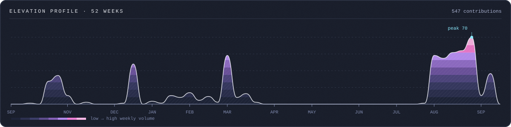

  

## 📝 Summary

Hi, I'm Dhruv Gupta, a software engineer and machine learning enthusiast. I enjoy working in the domain of machine learning and data science, where I can blend analytical thinking with creativity. I'm currently pursuing my B.Tech in Computer Science and Engineering (IoT & Intelligent Systems) at Manipal University Jaipur.I'm always excited to learn, collaborate, and contribute to meaningful tech projects.
Thanks for visiting my GitHub, looking forward to connecting and building something great together!

  
  

###

  
  
  
  
  
  
  
  
  
  
  
  
  
  
  
  
  
  
  
  
  
  
  
  
  
  
  
  
  
  
  
  
  
  
  
  
  
  
  
  
  
  
  
  
  

###

  
  

  

  

###

  

###
