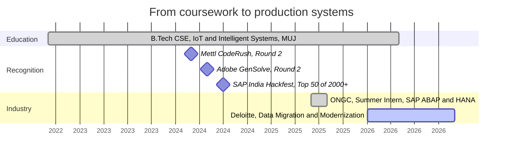
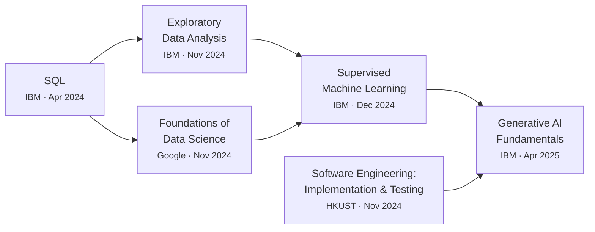

<picture>
  <source media="(prefers-color-scheme: dark)" srcset="./assets/banner-dark.svg">
  <source media="(prefers-color-scheme: light)" srcset="./assets/banner-light.svg">
  
</picture>

  

   

 

## About

I work on the seam between messy inputs and systems people can trust. Most of what I build reduces to the same problem in different clothes: a question arrives in a form a database cannot answer, and something has to turn it into a query, a vector, or a frame.

That has meant embedding food-service catalogues so a search understands intent rather than keywords, running a ResNet50 gaze estimator fast enough that a webcam feels responsive, and consolidating oil-well maintenance logs at ONGC that had lived in five departments and no single place. The through line is not the framework. It is caring whether the thing is still correct at eight million rows and still fast on the hundredth query.

Right now that instinct is pointed at enterprise data migration at Deloitte, where correctness under scale is the entire job rather than a nice-to-have.

> [!NOTE]
> **Currently building**
>
> - A **training and placement portal** for Manipal University Jaipur. Placement season is run on spreadsheets and WhatsApp threads at most colleges. This replaces that with role-based access, eligibility rules that filter applications automatically, and an audit trail for every status change.
> - **Retrieval infrastructure**: embeddings, hybrid search, and the unglamorous work of grounding model output in data that can actually be cited.
> - Deepening **SAP ABAP and HANA** on the enterprise side, migrating legacy structures without losing history.

 

## Selected work

Descriptions are mine. Stars, language and last-push date come from the API on every build, so the metrics cannot drift and a deleted repository drops out of this table on its own.

<!-- projects starts -->
<table>
<tr>
<td width="30%" valign="top"><b><a href="https://github.com/Dhruv-413/StockAnalysis">Stock Analysis</a></b> Multi-agent market analysis <code>Python</code>  ·  1 star  ·  updated 1 year ago</td>
<td valign="top">Answers questions like "why did Tesla drop today" by splitting the work across specialised agents: ticker resolution, price retrieval, news aggregation, historical comparison, then synthesis. The unglamorous half is what makes it usable &mdash; rate limiting, caching, and health checks around two external market APIs that fail in different ways.</td>
</tr>
<tr>
<td width="30%" valign="top"><b><a href="https://github.com/Dhruv-413/Eye-Gaze-Tracking-">Eye Gaze Tracking</a></b> Real-time gaze estimation <code>Python</code>  ·  updated 1 year ago</td>
<td valign="top">End-to-end pipeline from dataset normalisation through training to real-time cursor control off a plain webcam. Several model architectures behind one evaluation harness, because "which backbone is better" is only answerable if you can swap them without rewriting the pipeline.</td>
</tr>
<tr>
<td width="30%" valign="top"><b><a href="https://github.com/Dhruv-413/Dhruv">Portfolio</a></b> dhruvgupta-nu.vercel.app <code>TypeScript</code>  ·  updated 5 months ago</td>
<td valign="top">A portfolio that pulls its own GitHub activity at request time rather than listing projects by hand, so it cannot quietly go stale. Dark theme, motion that stays out of the way, and a performance budget it has to keep passing.</td>
</tr>
<tr>
<td width="30%" valign="top"><b><a href="https://github.com/Dhruv-413/EcoHive">EcoHive</a></b> SAP India Hackfest finalist <code>JavaScript</code>  ·  updated 2 years ago</td>
<td valign="top">A sustainable credit trading platform: log a verifiable green action, earn a credit, trade it. Built in a team of five under hackathon time pressure, which is where most of the actual lesson was.</td>
</tr>
</table>
<!-- projects ends -->

### Recently pushed

<!-- recent starts -->
- [**Dhruv-413**](https://github.com/Dhruv-413/Dhruv-413) — Config files for my GitHub profile  pushed just now
- [**Dhruv**](https://github.com/Dhruv-413/Dhruv)  TypeScript  ·  pushed 5 months ago
- [**SNA_Dhruv_Gupta_229311248**](https://github.com/Dhruv-413/SNA_Dhruv_Gupta_229311248)  Java  ·  pushed 9 months ago
- [**StockAnalysis**](https://github.com/Dhruv-413/StockAnalysis)  Python  ·  pushed 1 year ago
- [**Eye-Gaze-Tracking-**](https://github.com/Dhruv-413/Eye-Gaze-Tracking-)  Python  ·  pushed 1 year ago
<!-- recent ends -->

 

## How I got here

### What each of those actually involved

<table>
<tr>
<td width="30%" valign="top"><b>Deloitte</b> Data Migration and Modernization Analyst 2026 to present</td>
<td valign="top">Moving enterprise data between legacy and modern SAP structures. The interesting constraint is that a migration is judged entirely on what it did <em>not</em> lose, so most of the effort goes into reconciliation and verification rather than transfer.</td>
</tr>
<tr>
<td valign="top"><b>ONGC</b> Summer Intern, Delhi Jun to Aug 2025</td>
<td valign="top">Built a centralised SAP ABAP and HANA dashboard for oil well management, replacing manual reporting that was spread across five departments. Cut reporting time by <b>40%</b> and preprocessed <b>8M+ records</b> using Python, FAISS and PyTorch to make historical logs searchable.</td>
</tr>
<tr>
<td valign="top"><b>SAP India Hackfest</b> National Finalist Jul 2024</td>
<td valign="top">Led a team of five to a <b>Top 50 finish from 2000+ entries</b>, building EcoHive, a sustainable credit trading platform. Most of the learning was in scoping: deciding what to cut so the remaining thing worked end to end.</td>
</tr>
<tr>
<td valign="top"><b>Manipal University Jaipur</b> B.Tech CSE, IoT and Intelligent Systems 2022 to 2026, CGPA 8.06</td>
<td valign="top">Data structures, DBMS, operating systems and machine learning, plus the placement portal above, which turned out to teach more about requirements than any course did.</td>
</tr>
</table>

 

## Toolkit

Grouped by where I have actually shipped it, not by what I have read about.

| Domain | Tools | Shipped in |
| :--- | :--- | :--- |
| **Backend** | Python, FastAPI, Node.js, Go | Semantic search API, multi-agent NLP service |
| **Data** | PostgreSQL, pgvector, Redis, FAISS | Vector retrieval at sub-100ms, 8M+ record preprocessing |
| **AI / ML** | PyTorch, TensorFlow, OpenCV, MediaPipe, scikit-learn | Real-time gaze estimation at 30 FPS, transformer embeddings |
| **Frontend** | React, Next.js, TypeScript, Tailwind | Placement portal, EcoHive, this portfolio |
| **Enterprise** | SAP ABAP, HANA DB | ONGC well-management dashboard, Deloitte migrations |
| **Platform** | Docker, Git, GitHub Actions, Vercel | Containerised services, CI for every repo above |

 

## By the numbers

Six cards, all drawn by [`lib/cards.py`](./lib/cards.py) from the GitHub GraphQL API. No third-party stats service sits in the middle, which is deliberate: nothing here can rate-limit, pause, go down, or start rendering someone else's branding. Both themes are generated and your GitHub theme picks one.

<!-- graphs starts -->
<picture>
  <source media="(prefers-color-scheme: dark)" srcset="./assets/snapshot-dark.svg?v=2026090504">
  <source media="(prefers-color-scheme: light)" srcset="./assets/snapshot-light.svg?v=2026090504">
  
</picture>

<picture>
  <source media="(prefers-color-scheme: dark)" srcset="./assets/contributions-dark.svg?v=2026090504">
  <source media="(prefers-color-scheme: light)" srcset="./assets/contributions-light.svg?v=2026090504">
  
</picture>

<picture>
  <source media="(prefers-color-scheme: dark)" srcset="./assets/activity-dark.svg?v=2026090504">
  <source media="(prefers-color-scheme: light)" srcset="./assets/activity-light.svg?v=2026090504">
  
</picture>

<picture>
  <source media="(prefers-color-scheme: dark)" srcset="./assets/languages-dark.svg?v=2026090504">
  <source media="(prefers-color-scheme: light)" srcset="./assets/languages-light.svg?v=2026090504">
  
</picture>

<picture>
  <source media="(prefers-color-scheme: dark)" srcset="./assets/rhythm-dark.svg?v=2026090504">
  <source media="(prefers-color-scheme: light)" srcset="./assets/rhythm-light.svg?v=2026090504">
  
</picture>

<picture>
  <source media="(prefers-color-scheme: dark)" srcset="./assets/milestones-dark.svg?v=2026090504">
  <source media="(prefers-color-scheme: light)" srcset="./assets/milestones-light.svg?v=2026090504">
  
</picture>
<!-- graphs ends -->

The clock is real. Commit timestamps are converted to IST (UTC+05:30) and sampled from up to 100 recent commits across my 30 most recently pushed repositories, rather than assumed from a profile setting.

### The contribution graph, eaten

<!-- snake starts -->
_The snake is generated by the scheduled build._
<!-- snake ends -->

<b>The same figures as text</b>

 

<!-- snapshot starts -->
| | |
| :--- | ---: |
| Contributions, last 12 months | **469** |
| Commits | **150** |
| Pull requests opened | **7** |
| Issues opened | **2** |
| Reviews given | **0** |
| Public repositories | **8** |
| Stars earned | **1** |
| Current streak | **0 days** |
| Longest streak | **14 days** |
| Busiest single day | **24 contributions on 25 Oct 2025** |
| On GitHub for | **2.7 years** |
<!-- snapshot ends -->

**Where the code goes**

<!-- languages starts -->
| Language | Share | |
| :--- | :--- | ---: |
| **Jupyter Notebook** | `█████████████████░░░░░` | 77.6% |
| **TypeScript** | `███░░░░░░░░░░░░░░░░░░░` | 15.5% |
| **Python** | `█░░░░░░░░░░░░░░░░░░░░░` | 4.5% |
| **JavaScript** | `░░░░░░░░░░░░░░░░░░░░░░` | 1.4% |
| **CSS** | `░░░░░░░░░░░░░░░░░░░░░░` | 0.5% |
| **HTML** | `░░░░░░░░░░░░░░░░░░░░░░` | 0.2% |
<!-- languages ends -->

**When I actually commit**

<!-- rhythm starts -->
| Time of day (IST) | Window | Commits | |
| :--- | :--- | ---: | :--- |
| **Early morning** | 05:00 - 09:00 | 18 | `██░░░░░░░░░░░░░░░░` 12% |
| **Daytime** | 09:00 - 17:00 | 59 | `███████░░░░░░░░░░░` 39% |
| **Evening** | 17:00 - 22:00 | 23 | `███░░░░░░░░░░░░░░░` 15% |
| **Late night** | 22:00 - 05:00 | 51 | `██████░░░░░░░░░░░░` 34% |

Most active day of the week: **Tuesday**. All times are IST (UTC+5:30), computed from commit timestamps rather than assumed.
<!-- rhythm ends -->

 

## Certifications

Less a badge collection than a deliberate path: get the data layer right, learn to look at data before modelling it, then move up into supervised learning and generative systems.

<b>Verification links</b>

 

| Credential | Issuer | Date | |
| :--- | :--- | :--- | :--- |
| Generative AI Fundamentals Specialization | IBM | Apr 2025 | [Verify](https://www.coursera.org/account/accomplishments/specialization/3J6F007VM0D8) |
| Supervised Machine Learning | IBM | Dec 2024 | [Verify](https://www.coursera.org/account/accomplishments/verify/6I9AJ3Y0BVUG) |
| Exploratory Data Analysis for Machine Learning | IBM | Nov 2024 | [Verify](https://www.coursera.org/account/accomplishments/verify/1PHJMYY9JZGU) |
| Foundations of Data Science | Google | Nov 2024 | [Verify](https://www.coursera.org/account/accomplishments/verify/Q90KYBSORZ5M) |
| Software Engineering: Implementation and Testing | HKUST | Nov 2024 | [Verify](https://www.coursera.org/account/accomplishments/verify/DI0V4MISJN3G) |
| SQL: A Practical Introduction | IBM | Apr 2024 | [Verify](https://www.coursera.org/account/accomplishments/verify/SP4VAYZD688E) |

 

## How this page builds itself

Everything above that is a number rather than an opinion is generated. The drawing code is a shared library with two callers, so a live card and its committed fallback cannot drift apart.

<table>
<tr>
<td width="30%" valign="top"><b><a href="./lib/theme.py">lib/theme.py</a></b></td>
<td valign="top">One palette, one type scale, one set of geometry primitives. Two themes ship as separate files because a <code>prefers-color-scheme</code> query inside an SVG follows the reader's operating system rather than their GitHub theme, which is the wrong answer about half the time.</td>
</tr>
<tr>
<td valign="top"><b><a href="./lib/github.py">lib/github.py</a></b></td>
<td valign="top">One batched GraphQL pass. The commit history for thirty repositories arrives in a single aliased query; the obvious one-request-per-repository version took about thirty seconds, which no serverless function will wait for.</td>
</tr>
<tr>
<td valign="top"><b><a href="./lib/cards.py">lib/cards.py</a></b></td>
<td valign="top">Pure functions: data in, SVG out. No network, no filesystem, no clock, which is what lets them be tested without a token and rendered identically in both places.</td>
</tr>
<tr>
<td valign="top"><b><a href="./api/card.py">api/card.py</a></b></td>
<td valign="top">Serves a card on request, cached at the edge for thirty minutes so the API limit is never in play. It never returns an error status: on a profile page a 500 is just a broken image, so every failure path draws a card that says so instead.</td>
</tr>
<tr>
<td valign="top"><b><a href="./scripts/selftest.py">scripts/selftest.py</a></b></td>
<td valign="top">Renders every card in every theme against a fixture and a deliberately empty account, then asserts the output parses as XML and contains no stray <code>None</code>. Runs on every push, needs no token.</td>
</tr>
<tr>
<td valign="top"><b><a href="./.github/workflows/update-readme.yml">update-readme.yml</a></b></td>
<td valign="top">Runs every six hours, regenerates the cards and the tables, and commits only when a number actually changed.</td>
</tr>
</table>

 

## Get in touch

Open to AI/ML and full-stack collaboration, and happy to talk through anything above in more detail.

   

  

<!-- updated starts -->
_Last refreshed 05 September 2026, 04:25 IST · serving committed cards._
<!-- updated ends -->
