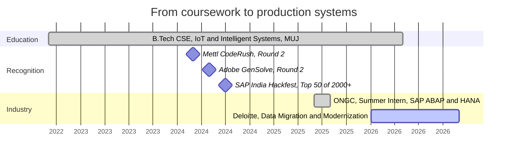
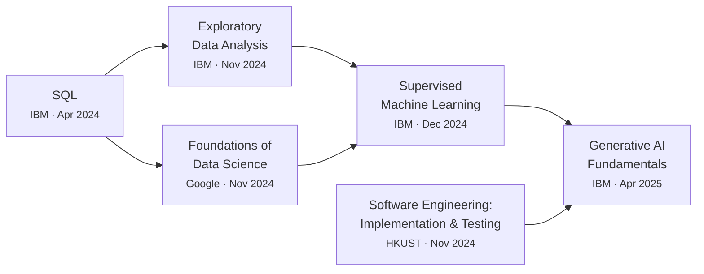

  

 

## About

I work on the seam between messy inputs and systems people can trust. Most of what I build reduces to the same problem in different clothes: a question arrives in a form a database cannot answer, and something has to turn it into a query, a vector, or a frame.

That has meant embedding food-service catalogues so a search understands intent rather than keywords, running a ResNet50 gaze estimator fast enough that a webcam feels responsive, and consolidating oil-well maintenance logs at ONGC that had lived in five departments and no single place. The through line is not the framework. It is caring whether the thing is still correct at eight million rows and still fast on the hundredth query.

Right now that instinct is pointed at enterprise data migration at Deloitte, where correctness under scale is the entire job rather than a nice-to-have.

> [!NOTE]
> **Currently building**
>
> - A **training and placement portal** for Manipal University Jaipur. Placement season is run on spreadsheets and WhatsApp threads at most colleges. This replaces that with role-based access, eligibility rules that filter applications automatically, and an audit trail for every status change.
> - **Retrieval infrastructure**: embeddings, hybrid search, and the unglamorous work of grounding model output in data that can actually be cited.
> - Deepening **SAP ABAP and HANA** on the enterprise side, migrating legacy structures without losing history.

 

## How I got here

### What each of those actually involved

<table>
<tr>
<td width="30%" valign="top"><b>Deloitte</b> Data Migration and Modernization Analyst 2026 to present</td>
<td valign="top">Moving enterprise data between legacy and modern SAP structures. The interesting constraint is that a migration is judged entirely on what it did <em>not</em> lose, so most of the effort goes into reconciliation and verification rather than transfer.</td>
</tr>
<tr>
<td valign="top"><b>ONGC</b> Summer Intern, Delhi Jun to Aug 2025</td>
<td valign="top">Built a centralised SAP ABAP and HANA dashboard for oil well management, replacing manual reporting that was spread across five departments. Cut reporting time by <b>40%</b> and preprocessed <b>8M+ records</b> using Python, FAISS and PyTorch to make historical logs searchable.</td>
</tr>
<tr>
<td valign="top"><b>SAP India Hackfest</b> National Finalist Jul 2024</td>
<td valign="top">Led a team of five to a <b>Top 50 finish from 2000+ entries</b>, building EcoHive, a sustainable credit trading platform. Most of the learning was in scoping: deciding what to cut so the remaining thing worked end to end.</td>
</tr>
<tr>
<td valign="top"><b>Manipal University Jaipur</b> B.Tech CSE, IoT and Intelligent Systems 2022 to 2026, CGPA 8.06</td>
<td valign="top">Data structures, DBMS, operating systems and machine learning, plus the placement portal above, which turned out to teach more about requirements than any course did.</td>
</tr>
</table>

 

## Toolkit

Grouped by where I have actually shipped it, not by what I have read about.

| Domain | Tools | Shipped in |
| :--- | :--- | :--- |
| **Backend** | Python, FastAPI, Node.js, Go | Semantic search API, multi-agent NLP service |
| **Data** | PostgreSQL, pgvector, Redis, FAISS | Vector retrieval at sub-100ms, 8M+ record preprocessing |
| **AI / ML** | PyTorch, TensorFlow, OpenCV, MediaPipe, scikit-learn | Real-time gaze estimation at 30 FPS, transformer embeddings |
| **Frontend** | React, Next.js, TypeScript, Tailwind | Placement portal, EcoHive, this portfolio |
| **Enterprise** | SAP ABAP, HANA DB | ONGC well-management dashboard, Deloitte migrations |
| **Platform** | Docker, Git, GitHub Actions, Vercel | Containerised services, CI for every repo above |

 

## By the numbers

These update themselves daily from the GitHub GraphQL API. Nothing here is hand-typed.

<!-- snapshot starts -->
| | |
| :--- | ---: |
| Contributions, last 12 months | **—** |
| Current streak | **—** |
_Run the workflow once to populate this._
<!-- snapshot ends -->

### Where the code goes

<!-- languages starts -->
| Language | Share | |
| :--- | :--- | ---: |
| **—** | `░░░░░░░░░░░░░░░░░░░░░░` | — |
<!-- languages ends -->

### When I actually commit

<!-- rhythm starts -->
| Time of day (IST) | Window | Commits | |
| :--- | :--- | ---: | :--- |
| **—** | | | |
<!-- rhythm ends -->

 

## Certifications

Less a badge collection than a deliberate path: get the data layer right, learn to look at data before modelling it, then move up into supervised learning and generative systems.

<b>Verification links</b>

 

| Credential | Issuer | Date | |
| :--- | :--- | :--- | :--- |
| Generative AI Fundamentals Specialization | IBM | Apr 2025 | [Verify](https://www.coursera.org/account/accomplishments/specialization/3J6F007VM0D8) |
| Supervised Machine Learning | IBM | Dec 2024 | [Verify](https://www.coursera.org/account/accomplishments/verify/6I9AJ3Y0BVUG) |
| Exploratory Data Analysis for Machine Learning | IBM | Nov 2024 | [Verify](https://www.coursera.org/account/accomplishments/verify/1PHJMYY9JZGU) |
| Foundations of Data Science | Google | Nov 2024 | [Verify](https://www.coursera.org/account/accomplishments/verify/Q90KYBSORZ5M) |
| Software Engineering: Implementation and Testing | HKUST | Nov 2024 | [Verify](https://www.coursera.org/account/accomplishments/verify/DI0V4MISJN3G) |
| SQL: A Practical Introduction | IBM | Apr 2024 | [Verify](https://www.coursera.org/account/accomplishments/verify/SP4VAYZD688E) |

 

## Get in touch

Open to AI/ML and full-stack collaboration, and happy to talk through anything above in more detail.

  

<!-- updated starts -->_Not yet refreshed._<!-- updated ends -->
