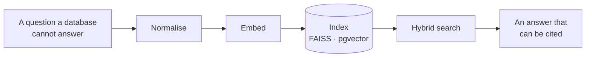

<div align="center">

<picture>
  <source media="(prefers-color-scheme: dark)" srcset="./assets/banner-dark.svg">
  <source media="(prefers-color-scheme: light)" srcset="./assets/banner-light.svg">
  
</picture>

<p>
  <a href="https://dhruvgupta-nu.vercel.app"><b>Portfolio</b></a> &nbsp;·&nbsp;
  <a href="https://www.linkedin.com/in/dhruvgpta/"><b>LinkedIn</b></a> &nbsp;·&nbsp;
  <a href="mailto:dhruvgupta6580@gmail.com"><b>Email</b></a> &nbsp;·&nbsp;
  <a href="https://dhruvgupta-nu.vercel.app/Dhruv_resume.pdf"><b>Résumé</b></a>
</p>

<sub>Data migration at Deloitte · final-year CS at Manipal University Jaipur · Ghaziabad, IST</sub>

</div>

## What I build

Most of what I build reduces to the same problem in different clothes: a question arrives in a form a database cannot answer, and something has to turn it into a query, a vector, or a frame.



That has meant embedding food-service catalogues so search understands intent rather than keywords, running a ResNet50 gaze estimator fast enough that a webcam feels responsive, and consolidating **8M+ oil-well maintenance records** at ONGC that had lived in five departments and no single place. The through line is not the framework — it is whether the thing is still correct at eight million rows and still fast on the hundredth query.

<sub>Shipped with **Python · FastAPI · PyTorch · PostgreSQL + pgvector · FAISS · TypeScript · Next.js · SAP ABAP/HANA · Docker**</sub>

> [!NOTE]
> Currently building a training-and-placement portal for MUJ, and deepening SAP data migration at Deloitte. Open to AI/ML and full-stack collaboration.

## Selected work

<!-- projects starts -->
<table>
<tr>
<td width="32%" valign="top"><b><a href="https://github.com/Dhruv-413/StockAnalysis">Stock Analysis</a></b><br/><sub>Multi-agent market analysis<br/><code>Python</code>  ·  1 star  ·  updated 1 year ago</sub></td>
<td valign="top">Answers "why did Tesla drop today" by splitting the work across specialised agents &mdash; ticker resolution, prices, news, history, then synthesis. The half that makes it usable is the rate limiting and caching around two market APIs that fail in different ways.</td>
</tr>
<tr>
<td width="32%" valign="top"><b><a href="https://github.com/Dhruv-413/Eye-Gaze-Tracking-">Eye Gaze Tracking</a></b><br/><sub>Real-time gaze estimation<br/><code>Python</code>  ·  updated 1 year ago</sub></td>
<td valign="top">Webcam to cursor control, end to end: dataset normalisation, training, then real-time inference. Several backbones sit behind one evaluation harness, because "which is better" is only answerable if you can swap them without rewriting the pipeline.</td>
</tr>
<tr>
<td width="32%" valign="top"><b><a href="https://github.com/Dhruv-413/Dhruv">Portfolio</a></b><br/><sub>dhruvgupta-nu.vercel.app<br/><code>TypeScript</code>  ·  updated 5 months ago</sub></td>
<td valign="top">Reads its own GitHub activity at request time instead of listing projects by hand, so it cannot quietly go stale.</td>
</tr>
<tr>
<td width="32%" valign="top"><b><a href="https://github.com/Dhruv-413/EcoHive">EcoHive</a></b><br/><sub>SAP India Hackfest finalist<br/><code>JavaScript</code>  ·  updated 2 years ago</sub></td>
<td valign="top">Log a verifiable green action, earn a credit, trade it. Built by five people under hackathon time pressure, which is where the actual lesson was.</td>
</tr>
</table>
<!-- projects ends -->

## The year, measured

Read from the GitHub GraphQL API and written into this file every six hours. Nothing here is typed by hand, and nothing here is an image — so it stays correct in either theme and cannot break.

<!-- snapshot starts -->
| Activity | | Reach | |
| :--- | ---: | :--- | ---: |
| Contributions, last 12 months | **469** | Public repositories | **7** |
| Commits authored | **149** | Stars earned | **1** |
| Pull requests opened | **7** | Current streak | **0 days** |
| Code reviews given | **0** | Longest streak | **14 days** |
| Busiest single day | **24** | that day was | **25 Oct 2025** |
<!-- snapshot ends -->

<!-- grid starts -->
```text
    Sep  Oct Nov  Dec Jan Feb Mar  Apr May  Jun Jul Aug  
    ·····░··▓······░░···░·░░░·░░░·····················▒░░
Mon ·▒··············░···░░░·░·▒░·░··················░█▒·░
    ·░······░░······░····░░·░░▒·░···················█▓▒▒▒
Wed ··░·····▒··░····▒····░░·░·▓····················░█░▒▒▒
    ·········▒······█····░░·░░░·░····················░░░·
Fri ················░·░·░░░░··░░░░···················░░▒·
    ·······█········░··░░··░··░░····················░░▒█·

    less ·░▒▓█ more         peak 24 contributions in a single day
```
<!-- grid ends -->

<details>
<summary><b>When I commit, what I write, and the shape of the year</b></summary>

<br/>

I am in India, so a graph drawn in UTC would put my evenings in the wrong place. These are real commit timestamps converted to IST.

<!-- rhythm starts -->
```text
    ▅▃▄▅█▅▃▄▂▄▆▅▇▇▄▄▃▃▃▄▃▄▆▅
    00    06    12    18   23   IST
```

| Time of day | Window | Commits | |
| :--- | :--- | ---: | :--- |
| **Early morning** | 05:00 - 09:00 | 18 | `██░░░░░░░░░░░░░░░░` 12% |
| **Daytime** | 09:00 - 17:00 | 59 | `███████░░░░░░░░░░░` 38% |
| **Evening** | 17:00 - 22:00 | 23 | `███░░░░░░░░░░░░░░░` 15% |
| **Late night** | 22:00 - 05:00 | 54 | `██████░░░░░░░░░░░░` 35% |

Peak hour **04:00** · busiest weekday **Tuesday**. Read from 154 commit timestamps converted to IST (UTC+05:30), rather than assumed from a profile setting.
<!-- rhythm ends -->

**The shape of the year**

<!-- trend starts -->
```text
    ▁▂▁▁▁▁▁▄▅▂▁▁▁▁▁▁▆▁▁▁▂▂▃▂▂▁▇▂▂▁▁▁▁▁▁▁▁▁▁▁▁▁▁▁▁▁▁▁▇▇██▄
    a year ago                                  this week
```

<details>
<summary>Month by month</summary>

| Month | Contributions | |
| :--- | ---: | :--- |
| Oct 2025 | 55 | `█████░░░░░░░░░░░░░` |
| Nov 2025 | 11 | `█░░░░░░░░░░░░░░░░░` |
| Dec 2025 | 43 | `████░░░░░░░░░░░░░░` |
| Jan 2026 | 20 | `██░░░░░░░░░░░░░░░░` |
| Feb 2026 | 26 | `██░░░░░░░░░░░░░░░░` |
| Mar 2026 | 71 | `██████░░░░░░░░░░░░` |
| Apr 2026 | 0 | `░░░░░░░░░░░░░░░░░░` |
| May 2026 | 0 | `░░░░░░░░░░░░░░░░░░` |
| Jun 2026 | 0 | `░░░░░░░░░░░░░░░░░░` |
| Jul 2026 | 1 | `░░░░░░░░░░░░░░░░░░` |
| Aug 2026 | 216 | `██████████████████` |
| Sep 2026 | 16 | `█░░░░░░░░░░░░░░░░░` |

</details>
<!-- trend ends -->

**Language footprint**

Worth a caveat: this counts *bytes*, and a Jupyter notebook stores its own rendered output inside the file. Three notebook repositories carry about 9 MB of embedded plots between them, which is why the top line is what it is. It measures artefacts, not the work.

<!-- languages starts -->
| Language | Share | |
| :--- | :--- | ---: |
| **Jupyter Notebook** | `█████████████████░░░░░` | 77.2% |
| **TypeScript** | `███░░░░░░░░░░░░░░░░░░░` | 15.5% |
| **Python** | `█░░░░░░░░░░░░░░░░░░░░░` | 5.1% |
| **JavaScript** | `░░░░░░░░░░░░░░░░░░░░░░` | 1.4% |
| **CSS** | `░░░░░░░░░░░░░░░░░░░░░░` | 0.5% |
| **HTML** | `░░░░░░░░░░░░░░░░░░░░░░` | 0.2% |
<!-- languages ends -->

**Worth keeping**

<!-- milestones starts -->
| Milestone | Figure | |
| :--- | ---: | :--- |
| Longest streak | **14 days** | <sub>consecutive days with a contribution</sub> |
| Busiest day | **24 contributions** | <sub>25 October 2025</sub> |
| Languages shipped | **9** | <sub>across public repositories</sub> |
| On GitHub | **2.7 years** | <sub>12 repositories owned, excluding forks</sub> |
<!-- milestones ends -->

**Recently pushed**

<!-- recent starts -->
- [**Dhruv**](https://github.com/Dhruv-413/Dhruv)  <sub>TypeScript  ·  pushed 5 months ago</sub>
- [**SNA_Dhruv_Gupta_229311248**](https://github.com/Dhruv-413/SNA_Dhruv_Gupta_229311248)  <sub>Java  ·  pushed 9 months ago</sub>
- [**StockAnalysis**](https://github.com/Dhruv-413/StockAnalysis)  <sub>Python  ·  pushed 1 year ago</sub>
- [**Eye-Gaze-Tracking-**](https://github.com/Dhruv-413/Eye-Gaze-Tracking-)  <sub>Python  ·  pushed 1 year ago</sub>
- [**Basic-ML-Projects**](https://github.com/Dhruv-413/Basic-ML-Projects)  <sub>Jupyter Notebook  ·  pushed 2 years ago</sub>
<!-- recent ends -->

</details>

<details>
<summary><b>Experience and credentials</b></summary>

<br/>

<table>
<tr>
<td width="32%" valign="top"><b>Deloitte</b><br/><sub>Data Migration and Modernization Analyst · 2026 to present</sub></td>
<td valign="top">Moving enterprise data between legacy and modern SAP structures. A migration is judged entirely on what it did <em>not</em> lose, so most of the effort is reconciliation and verification rather than transfer.</td>
</tr>
<tr>
<td valign="top"><b>ONGC</b><br/><sub>Summer Intern, Delhi · Jun–Aug 2025</sub></td>
<td valign="top">Built a centralised SAP ABAP and HANA dashboard for oil-well management, replacing manual reporting spread across five departments. Cut reporting time by <b>40%</b> and preprocessed <b>8M+ records</b> with Python, FAISS and PyTorch.</td>
</tr>
<tr>
<td valign="top"><b>SAP India Hackfest</b><br/><sub>National Finalist · Jul 2024</sub></td>
<td valign="top">Led five people to a <b>Top 50 finish from 2000+ entries</b> with EcoHive. The lesson was in scoping: deciding what to cut so the rest worked end to end.</td>
</tr>
<tr>
<td valign="top"><b>Manipal University Jaipur</b><br/><sub>B.Tech CSE, IoT and Intelligent Systems · 2022–2026, CGPA 8.06</sub></td>
<td valign="top">Data structures, DBMS, operating systems and machine learning — plus the placement portal, which taught more about requirements than any course did.</td>
</tr>
</table>

**Certifications** — a deliberate path rather than a badge collection: get the data layer right, learn to look at data before modelling it, then move up into supervised learning and generative systems.

| Credential | Issuer | Date | |
| :--- | :--- | :--- | :--- |
| Generative AI Fundamentals Specialization | IBM | Apr 2025 | [Verify](https://www.coursera.org/account/accomplishments/specialization/3J6F007VM0D8) |
| Supervised Machine Learning | IBM | Dec 2024 | [Verify](https://www.coursera.org/account/accomplishments/verify/6I9AJ3Y0BVUG) |
| Exploratory Data Analysis for Machine Learning | IBM | Nov 2024 | [Verify](https://www.coursera.org/account/accomplishments/verify/1PHJMYY9JZGU) |
| Foundations of Data Science | Google | Nov 2024 | [Verify](https://www.coursera.org/account/accomplishments/verify/Q90KYBSORZ5M) |
| Software Engineering: Implementation and Testing | HKUST | Nov 2024 | [Verify](https://www.coursera.org/account/accomplishments/verify/DI0V4MISJN3G) |
| SQL: A Practical Introduction | IBM | Apr 2024 | [Verify](https://www.coursera.org/account/accomplishments/verify/SP4VAYZD688E) |

</details>

<div align="center">
<br/>

**Happy to talk through any of it.** &nbsp;·&nbsp; <a href="mailto:dhruvgupta6580@gmail.com">dhruvgupta6580@gmail.com</a>

<sub><!-- updated starts -->
_Rebuilt from the GitHub GraphQL API on 05 September 2026 at 05:29 IST._
<!-- updated ends --></sub>

</div>
