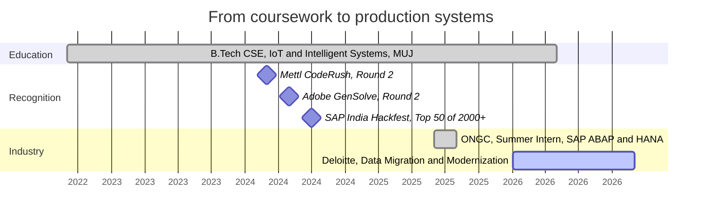
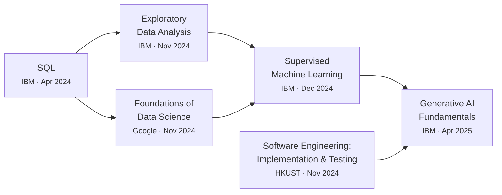

<div align="center">

<picture>
  <source media="(prefers-color-scheme: dark)" srcset="./assets/banner-dark.svg">
  <source media="(prefers-color-scheme: light)" srcset="./assets/banner-light.svg">
  
</picture>

<br/><br/>

<a href="https://dhruvgupta-nu.vercel.app"></a> <a href="https://www.linkedin.com/in/dhruvgpta/"></a> <a href="mailto:dhruvgupta6580@gmail.com"></a> <a href="https://dhruvgupta-nu.vercel.app/Dhruv_resume.pdf"></a>

</div>

<br/>

## About

I work on the seam between messy inputs and systems people can trust. Most of what I build reduces to the same problem in different clothes: a question arrives in a form a database cannot answer, and something has to turn it into a query, a vector, or a frame.

That has meant embedding food-service catalogues so a search understands intent rather than keywords, running a ResNet50 gaze estimator fast enough that a webcam feels responsive, and consolidating oil-well maintenance logs at ONGC that had lived in five departments and no single place. The through line is not the framework. It is caring whether the thing is still correct at eight million rows and still fast on the hundredth query.

Right now that instinct is pointed at enterprise data migration at Deloitte, where correctness under scale is the entire job rather than a nice-to-have.

> [!NOTE]
> **Currently building**
>
> - A **training and placement portal** for Manipal University Jaipur. Placement season runs on spreadsheets and WhatsApp threads at most colleges. This replaces that with role-based access, eligibility rules that filter applications automatically, and an audit trail for every status change.
> - **Retrieval infrastructure** — embeddings, hybrid search, and the unglamorous work of grounding model output in data that can actually be cited.
> - Deepening **SAP ABAP and HANA**, migrating legacy structures without losing history.

<br/>

## Selected work

The descriptions are mine. Stars, language and last-push date are read from the API on every build, so the metrics cannot drift, and a repository that disappears drops out of this table on its own.

<!-- projects starts -->
<table>
<tr>
<td width="32%" valign="top"><b><a href="https://github.com/Dhruv-413/StockAnalysis">Stock Analysis</a></b><br/><sub>Multi-agent market analysis<br/><code>Python</code>  ·  1 star  ·  updated 1 year ago</sub></td>
<td valign="top">Answers questions like "why did Tesla drop today" by splitting the work across specialised agents: ticker resolution, price retrieval, news aggregation, historical comparison, then synthesis. The unglamorous half is what makes it usable &mdash; rate limiting, caching, and health checks around two external market APIs that fail in different ways.</td>
</tr>
<tr>
<td width="32%" valign="top"><b><a href="https://github.com/Dhruv-413/Eye-Gaze-Tracking-">Eye Gaze Tracking</a></b><br/><sub>Real-time gaze estimation<br/><code>Python</code>  ·  updated 1 year ago</sub></td>
<td valign="top">End-to-end pipeline from dataset normalisation through training to real-time cursor control off a plain webcam. Several model architectures behind one evaluation harness, because "which backbone is better" is only answerable if you can swap them without rewriting the pipeline.</td>
</tr>
<tr>
<td width="32%" valign="top"><b><a href="https://github.com/Dhruv-413/Dhruv">Portfolio</a></b><br/><sub>dhruvgupta-nu.vercel.app<br/><code>TypeScript</code>  ·  updated 5 months ago</sub></td>
<td valign="top">A portfolio that pulls its own GitHub activity at request time rather than listing projects by hand, so it cannot quietly go stale. Dark theme, motion that stays out of the way, and a performance budget it has to keep passing.</td>
</tr>
<tr>
<td width="32%" valign="top"><b><a href="https://github.com/Dhruv-413/EcoHive">EcoHive</a></b><br/><sub>SAP India Hackfest finalist<br/><code>JavaScript</code>  ·  updated 2 years ago</sub></td>
<td valign="top">A sustainable credit trading platform: log a verifiable green action, earn a credit, trade it. Built in a team of five under hackathon time pressure, which is where most of the actual lesson was.</td>
</tr>
</table>
<!-- projects ends -->

<details>
<summary><b>Recently pushed</b></summary>

<br/>

<!-- recent starts -->
- [**Dhruv**](https://github.com/Dhruv-413/Dhruv)  <sub>TypeScript  ·  pushed 5 months ago</sub>
- [**SNA_Dhruv_Gupta_229311248**](https://github.com/Dhruv-413/SNA_Dhruv_Gupta_229311248)  <sub>Java  ·  pushed 9 months ago</sub>
- [**StockAnalysis**](https://github.com/Dhruv-413/StockAnalysis)  <sub>Python  ·  pushed 1 year ago</sub>
- [**Eye-Gaze-Tracking-**](https://github.com/Dhruv-413/Eye-Gaze-Tracking-)  <sub>Python  ·  pushed 1 year ago</sub>
- [**Basic-ML-Projects**](https://github.com/Dhruv-413/Basic-ML-Projects)  <sub>Jupyter Notebook  ·  pushed 2 years ago</sub>
<!-- recent ends -->

</details>

<br/>

## Experience



<table>
<tr>
<td width="32%" valign="top"><b>Deloitte</b><br/><sub>Data Migration and Modernization Analyst<br/>2026 to present</sub></td>
<td valign="top">Moving enterprise data between legacy and modern SAP structures. The interesting constraint is that a migration is judged entirely on what it did <em>not</em> lose, so most of the effort goes into reconciliation and verification rather than transfer.</td>
</tr>
<tr>
<td valign="top"><b>ONGC</b><br/><sub>Summer Intern, Delhi<br/>Jun to Aug 2025</sub></td>
<td valign="top">Built a centralised SAP ABAP and HANA dashboard for oil well management, replacing manual reporting spread across five departments. Cut reporting time by <b>40%</b> and preprocessed <b>8M+ records</b> with Python, FAISS and PyTorch to make historical logs searchable.</td>
</tr>
<tr>
<td valign="top"><b>SAP India Hackfest</b><br/><sub>National Finalist<br/>Jul 2024</sub></td>
<td valign="top">Led a team of five to a <b>Top 50 finish from 2000+ entries</b> with EcoHive. Most of the learning was in scoping: deciding what to cut so the remaining thing worked end to end.</td>
</tr>
<tr>
<td valign="top"><b>Manipal University Jaipur</b><br/><sub>B.Tech CSE, IoT and Intelligent Systems<br/>2022 to 2026, CGPA 8.06</sub></td>
<td valign="top">Data structures, DBMS, operating systems and machine learning, plus the placement portal above, which taught more about requirements than any course did.</td>
</tr>
</table>

<br/>

## Toolkit

Grouped by where I have actually shipped it, not by what I have read about.

| Domain | Tools | Shipped in |
| :--- | :--- | :--- |
| **Backend** | Python, FastAPI, Node.js, Go | Semantic search API, multi-agent NLP service |
| **Data** | PostgreSQL, pgvector, Redis, FAISS | Vector retrieval at sub-100ms, 8M+ record preprocessing |
| **AI / ML** | PyTorch, TensorFlow, OpenCV, MediaPipe, scikit-learn | Real-time gaze estimation at 30 FPS, transformer embeddings |
| **Frontend** | React, Next.js, TypeScript, Tailwind | Placement portal, EcoHive, portfolio |
| **Enterprise** | SAP ABAP, HANA DB | ONGC well-management dashboard, Deloitte migrations |
| **Platform** | Docker, Git, GitHub Actions, Vercel | Containerised services, CI for every repo above |

<br/>

## The year, measured

Every figure below is read from the GitHub GraphQL API and written into this file by a scheduled workflow. Nothing here is typed by hand, and nothing here is an image — which means it stays correct in either GitHub theme, stays selectable, and cannot break.

<!-- snapshot starts -->
| Activity | | Reach | |
| :--- | ---: | :--- | ---: |
| Contributions, last 12 months | **469** | Public repositories | **7** |
| Commits authored | **149** | Stars earned | **1** |
| Pull requests opened | **7** | Current streak | **0 days** |
| Code reviews given | **0** | Longest streak | **14 days** |
| Busiest single day | **24** | that day was | **25 Oct 2025** |
<!-- snapshot ends -->

### Contribution graph

<!-- grid starts -->
```text
    Sep  Oct Nov  Dec Jan Feb Mar  Apr May  Jun Jul Aug  
    ·····░··▓······░░···░·░░░·░░░·····················▒░░
Mon ·▒··············░···░░░·░·▒░·░··················░█▒·░
    ·░······░░······░····░░·░░▒·░···················█▓▒▒▒
Wed ··░·····▒··░····▒····░░·░·▓····················░█░▒▒▒
    ·········▒······█····░░·░░░·░····················░░░·
Fri ················░·░·░░░░··░░░░···················░░▒·
    ·······█········░··░░··░··░░····················░░▒█·

    less ·░▒▓█ more         peak 24 contributions in a single day
```
<!-- grid ends -->

### The shape of the year

<!-- trend starts -->
```text
    ▁▂▁▁▁▁▁▄▅▂▁▁▁▁▁▁▆▁▁▁▂▂▃▂▂▁▇▂▂▁▁▁▁▁▁▁▁▁▁▁▁▁▁▁▁▁▁▁▇▇██▄
    a year ago                                  this week
```

<details>
<summary>Month by month</summary>

| Month | Contributions | |
| :--- | ---: | :--- |
| Oct 2025 | 55 | `█████░░░░░░░░░░░░░` |
| Nov 2025 | 11 | `█░░░░░░░░░░░░░░░░░` |
| Dec 2025 | 43 | `████░░░░░░░░░░░░░░` |
| Jan 2026 | 20 | `██░░░░░░░░░░░░░░░░` |
| Feb 2026 | 26 | `██░░░░░░░░░░░░░░░░` |
| Mar 2026 | 71 | `██████░░░░░░░░░░░░` |
| Apr 2026 | 0 | `░░░░░░░░░░░░░░░░░░` |
| May 2026 | 0 | `░░░░░░░░░░░░░░░░░░` |
| Jun 2026 | 0 | `░░░░░░░░░░░░░░░░░░` |
| Jul 2026 | 1 | `░░░░░░░░░░░░░░░░░░` |
| Aug 2026 | 216 | `██████████████████` |
| Sep 2026 | 16 | `█░░░░░░░░░░░░░░░░░` |

</details>
<!-- trend ends -->

### When I actually commit

I am in India, so a graph drawn in UTC would put my evenings in the wrong place. These are real commit timestamps converted to IST.

<!-- rhythm starts -->
```text
    ▅▃▄▅█▅▃▄▂▄▆▅▇▇▄▄▃▃▃▄▃▄▆▅
    00    06    12    18   23   IST
```

| Time of day | Window | Commits | |
| :--- | :--- | ---: | :--- |
| **Early morning** | 05:00 - 09:00 | 18 | `██░░░░░░░░░░░░░░░░` 12% |
| **Daytime** | 09:00 - 17:00 | 59 | `███████░░░░░░░░░░░` 38% |
| **Evening** | 17:00 - 22:00 | 23 | `███░░░░░░░░░░░░░░░` 15% |
| **Late night** | 22:00 - 05:00 | 54 | `██████░░░░░░░░░░░░` 35% |

Peak hour **04:00** · busiest weekday **Tuesday**. Read from 154 commit timestamps converted to IST (UTC+05:30), rather than assumed from a profile setting.
<!-- rhythm ends -->

### Where the code goes

<!-- languages starts -->
| Language | Share | |
| :--- | :--- | ---: |
| **Jupyter Notebook** | `█████████████████░░░░░` | 77.2% |
| **TypeScript** | `███░░░░░░░░░░░░░░░░░░░` | 15.5% |
| **Python** | `█░░░░░░░░░░░░░░░░░░░░░` | 5.1% |
| **JavaScript** | `░░░░░░░░░░░░░░░░░░░░░░` | 1.4% |
| **CSS** | `░░░░░░░░░░░░░░░░░░░░░░` | 0.5% |
| **HTML** | `░░░░░░░░░░░░░░░░░░░░░░` | 0.2% |
<!-- languages ends -->

### Worth keeping

Not a trophy wall. Every line is computed from this account's own history.

<!-- milestones starts -->
| Milestone | Figure | |
| :--- | ---: | :--- |
| Longest streak | **14 days** | <sub>consecutive days with a contribution</sub> |
| Busiest day | **24 contributions** | <sub>25 October 2025</sub> |
| Languages shipped | **9** | <sub>across public repositories</sub> |
| On GitHub | **2.7 years** | <sub>12 repositories owned, excluding forks</sub> |
<!-- milestones ends -->

<br/>

## Certifications

Less a badge collection than a deliberate path: get the data layer right, learn to look at data before modelling it, then move up into supervised learning and generative systems.



<details>
<summary><b>Verification links</b></summary>

<br/>

| Credential | Issuer | Date | |
| :--- | :--- | :--- | :--- |
| Generative AI Fundamentals Specialization | IBM | Apr 2025 | [Verify](https://www.coursera.org/account/accomplishments/specialization/3J6F007VM0D8) |
| Supervised Machine Learning | IBM | Dec 2024 | [Verify](https://www.coursera.org/account/accomplishments/verify/6I9AJ3Y0BVUG) |
| Exploratory Data Analysis for Machine Learning | IBM | Nov 2024 | [Verify](https://www.coursera.org/account/accomplishments/verify/1PHJMYY9JZGU) |
| Foundations of Data Science | Google | Nov 2024 | [Verify](https://www.coursera.org/account/accomplishments/verify/Q90KYBSORZ5M) |
| Software Engineering: Implementation and Testing | HKUST | Nov 2024 | [Verify](https://www.coursera.org/account/accomplishments/verify/DI0V4MISJN3G) |
| SQL: A Practical Introduction | IBM | Apr 2024 | [Verify](https://www.coursera.org/account/accomplishments/verify/SP4VAYZD688E) |

</details>

<br/>

## How this page builds itself

<details>
<summary><b>Two SVGs, and everything else in plain markdown</b></summary>

<br/>

The whole page is two committed images and a text file. That is a design decision rather than a limitation, and it is the second version — the first drew the statistics as SVG cards, which looked good and was wrong.

The reason it was wrong: a `<picture>` element with `prefers-color-scheme` resolves against the reader's **operating system**, not their GitHub theme. Set GitHub to dark on a light laptop and every card arrives in the wrong palette. Markdown has no such failure mode, and it is also selectable, searchable, and legible to a screen reader. The character grid above is the same data the SVG heatmap held, and it cannot render in the wrong colours because it has none.

| | |
| :--- | :--- |
| [`lib/github.py`](./lib/github.py) | One batched GraphQL pass. The commit history for thirty repositories arrives in a single aliased query; the obvious one-request-per-repository version took about thirty seconds. |
| [`lib/theme.py`](./lib/theme.py) | Palette and geometry for the banner. Two themes ship as separate files, which is exactly the `prefers-color-scheme` compromise described above — acceptable for one decorative header, not for six data cards. |
| [`scripts/build_banner.py`](./scripts/build_banner.py) | Draws the header. The point cloud is a seeded k-nearest-neighbour sketch, which is the same picture as the retrieval work described at the top and the only reason it earns the space. |
| [`scripts/build_readme.py`](./scripts/build_readme.py) | Turns one API response into every table, bar and sparkline on this page. Standard library only. |
| [`scripts/selftest.py`](./scripts/selftest.py) | Renders every block against a fixture and a deliberately empty account, then checks the markdown is well formed. Runs on every push, needs no token. |
| [`.github/workflows/`](./.github/workflows/update-readme.yml) | Runs every six hours and commits only when a number actually changed. |

</details>

<br/>

## Get in touch

Open to AI/ML and full-stack collaboration, and happy to talk through anything above in more detail.

<a href="https://dhruvgupta-nu.vercel.app"></a> <a href="https://www.linkedin.com/in/dhruvgpta/"></a> <a href="mailto:dhruvgupta6580@gmail.com"></a> <a href="https://dhruvgupta-nu.vercel.app/Dhruv_resume.pdf"></a>

<br/><br/>

<sub><!-- updated starts -->
_Rebuilt from the GitHub GraphQL API on 05 September 2026 at 05:02 IST._
<!-- updated ends --></sub>
